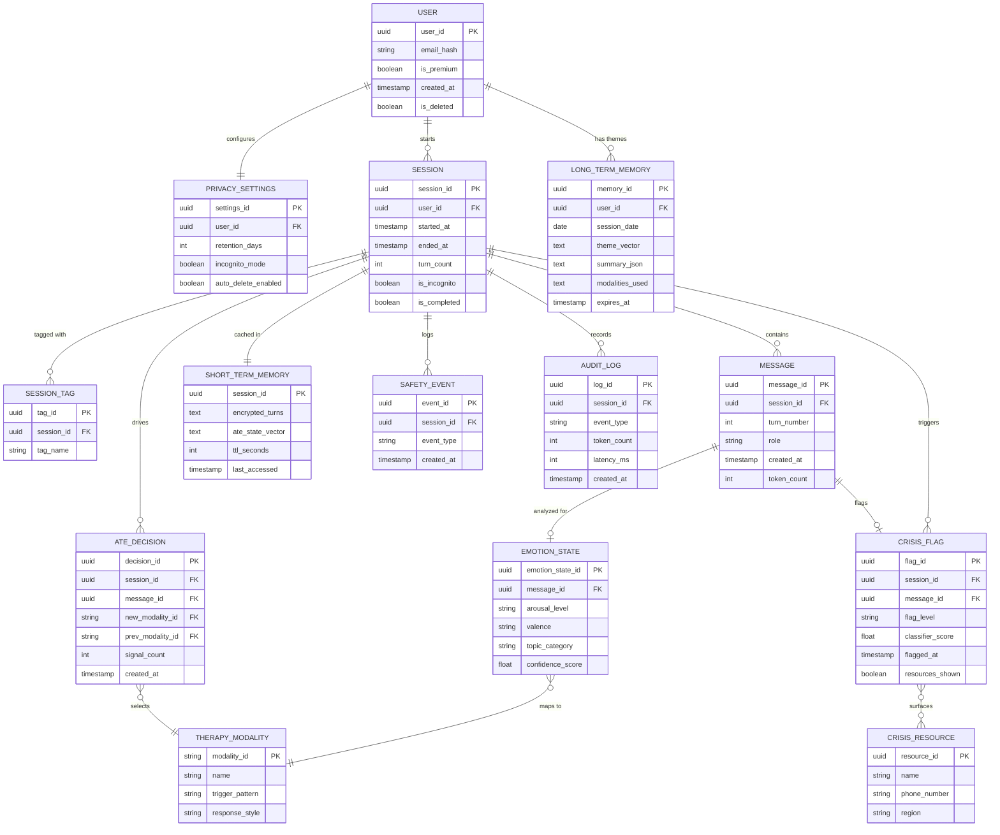

---

## ER Diagram

```mermaid
erDiagram
    USER {
        uuid user_id PK
        string email_hash
        boolean is_premium
        timestamp created_at
        boolean is_deleted
    }
    PRIVACY_SETTINGS {
        uuid settings_id PK
        uuid user_id FK
        int retention_days
        boolean incognito_mode
        boolean auto_delete_enabled
    }
    SESSION {
        uuid session_id PK
        uuid user_id FK
        timestamp started_at
        timestamp ended_at
        int turn_count
        boolean is_incognito
        boolean is_completed
    }
    SESSION_TAG {
        uuid tag_id PK
        uuid session_id FK
        string tag_name
    }
    MESSAGE {
        uuid message_id PK
        uuid session_id FK
        int turn_number
        string role
        timestamp created_at
        int token_count
    }
    EMOTION_STATE {
        uuid emotion_state_id PK
        uuid message_id FK
        string arousal_level
        string valence
        string topic_category
        float confidence_score
    }
    THERAPY_MODALITY {
        string modality_id PK
        string name
        string trigger_pattern
        string response_style
    }
    ATE_DECISION {
        uuid decision_id PK
        uuid session_id FK
        uuid message_id FK
        string new_modality_id FK
        string prev_modality_id FK
        int signal_count
        timestamp created_at
    }
    SHORT_TERM_MEMORY {
        uuid session_id PK
        text encrypted_turns
        text ate_state_vector
        int ttl_seconds
        timestamp last_accessed
    }
    LONG_TERM_MEMORY {
        uuid memory_id PK
        uuid user_id FK
        date session_date
        text theme_vector
        text summary_json
        text modalities_used
        timestamp expires_at
    }
    CRISIS_FLAG {
        uuid flag_id PK
        uuid session_id FK
        uuid message_id FK
        string flag_level
        float classifier_score
        timestamp flagged_at
        boolean resources_shown
    }
    CRISIS_RESOURCE {
        uuid resource_id PK
        string name
        string phone_number
        string region
    }
    SAFETY_EVENT {
        uuid event_id PK
        uuid session_id FK
        string event_type
        timestamp created_at
    }
    AUDIT_LOG {
        uuid log_id PK
        uuid session_id FK
        string event_type
        int token_count
        int latency_ms
        timestamp created_at
    }

    USER ||--|| PRIVACY_SETTINGS : "configures"
    USER ||--o{ SESSION : "starts"
    USER ||--o{ LONG_TERM_MEMORY : "has themes"
    SESSION ||--o{ MESSAGE : "contains"
    SESSION ||--o{ SESSION_TAG : "tagged with"
    SESSION ||--|| SHORT_TERM_MEMORY : "cached in"
    SESSION ||--o{ CRISIS_FLAG : "triggers"
    SESSION ||--o{ SAFETY_EVENT : "logs"
    SESSION ||--o{ AUDIT_LOG : "records"
    SESSION ||--o{ ATE_DECISION : "drives"
    MESSAGE ||--o| EMOTION_STATE : "analyzed for"
    MESSAGE ||--o| CRISIS_FLAG : "flags"
    EMOTION_STATE }o--|| THERAPY_MODALITY : "maps to"
    ATE_DECISION }o--|| THERAPY_MODALITY : "selects"
    CRISIS_FLAG }o--o{ CRISIS_RESOURCE : "surfaces"
```

---
