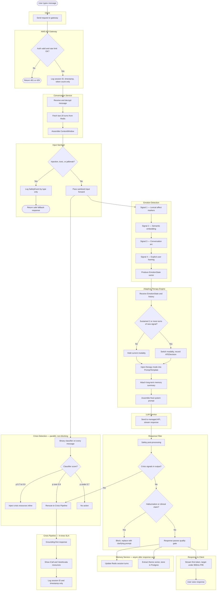

## Flow Diagram
 

```mermaid
flowchart TD
    START([User types message])
 
    subgraph CLIENT["Client"]
        ENC[Send request to gateway]
    end
 
    subgraph GATEWAY["AWS API Gateway"]
        AUTH{Auth valid and rate limit OK?}
        REJECT([Return 401 or 429])
        METALOG[Log session ID, timestamp, token count only]
    end
 
    subgraph CONV["Conversation Service"]
        DECRYPT[Receive and decrypt message]
        FETCH[Fetch last 20 turns from Redis]
        ASSEMBLE[Assemble ContextWindow]
    end
 
    subgraph SANITIZE["Input Sanitizer"]
        SANCHECK{Injection, toxic, or jailbreak?}
        SAFELOG[Log SafetyEvent by type only]
        SAFERESP([Return safe fallback response])
        CLEAN[Pass sanitized input forward]
    end
 
    subgraph EMOTION["Emotion Detection"]
        LEX[Signal 1 — Lexical affect markers]
        SEM[Signal 2 — Semantic embedding]
        ARC[Signal 3 — Conversation arc]
        EXPLICIT[Signal 4 — Explicit user framing]
        ESTATE[Produce EmotionState vector]
    end
 
    subgraph CRISIS_D["Crisis Detection — parallel, non-blocking"]
        CCLASSIFY[Binary classifier on every message]
        CSCORE{Classifier score?}
        SOFTFLAG[Inject crisis resources inline]
        HARDFLAG[Reroute to Crisis Pipeline]
        NOCRISIS[No action]
    end
 
    subgraph CRISIS_P["Crisis Pipeline — 4-nines SLA"]
        CGROUND[Grounding-first response]
        CRESOURCE[Show iCall and Vandrevala resources]
        CAUDIT[Log session ID and timestamp only]
    end
 
    subgraph ATE_BOX["Adaptive Therapy Engine"]
        ATERECV[Receive EmotionState and history]
        ATELOCK{Sustained 2 or more turns of new signal?}
        HOLDMODE[Hold current modality]
        SWITCHMODE[Switch modality, record ATEDecision]
        INJECT[Inject therapy mode into PromptTemplate]
        ATTACHMEM[Attach long-term memory summary]
        BUILDPROMPT[Assemble final system prompt]
    end
 
    subgraph LLM_BOX["LLM Service"]
        LLMSTREAM[Send to managed API, stream response]
    end
 
    subgraph RF_BOX["Response Filter"]
        RFSAFE[Safety post-processing]
        RFCRISIS{Crisis signals in output?}
        RFHALLUC{Hallucination or clinical claim?}
        RFBLOCK[Block, replace with clarifying prompt]
        RFPASS[Response passes quality gate]
    end
 
    subgraph MEM_BOX["Memory Service — async after response sent"]
        MEMSHORT[Update Redis session turns]
        MEMLONG[Extract theme vector, store in Postgres]
    end
 
    subgraph RESP["Response to Client"]
        STREAM[Stream first token, target under 800ms P95]
        DONE([User sees response])
    end
 
    START --> ENC
    ENC --> AUTH
    AUTH -- No --> REJECT
    AUTH -- Yes --> METALOG
    METALOG --> DECRYPT
    DECRYPT --> FETCH
    FETCH --> ASSEMBLE
    ASSEMBLE --> SANCHECK
    SANCHECK -- Yes --> SAFELOG
    SAFELOG --> SAFERESP
    SANCHECK -- No --> CLEAN
 
    CLEAN --> LEX
    LEX --> SEM
    SEM --> ARC
    ARC --> EXPLICIT
    EXPLICIT --> ESTATE
 
    CLEAN --> CCLASSIFY
    CCLASSIFY --> CSCORE
    CSCORE -- p over 0.9 --> HARDFLAG
    CSCORE -- p 0.7 to 0.9 --> SOFTFLAG
    CSCORE -- p under 0.7 --> NOCRISIS
    HARDFLAG --> CGROUND
    CGROUND --> CRESOURCE
    CRESOURCE --> CAUDIT
 
    ESTATE --> ATERECV
    ATERECV --> ATELOCK
    ATELOCK -- No --> HOLDMODE
    ATELOCK -- Yes --> SWITCHMODE
    HOLDMODE --> INJECT
    SWITCHMODE --> INJECT
    INJECT --> ATTACHMEM
    ATTACHMEM --> BUILDPROMPT
 
    BUILDPROMPT --> LLMSTREAM
 
    LLMSTREAM --> RFSAFE
    RFSAFE --> RFCRISIS
    RFCRISIS -- Yes --> HARDFLAG
    RFCRISIS -- No --> RFHALLUC
    RFHALLUC -- Yes --> RFBLOCK
    RFHALLUC -- No --> RFPASS
 
    RFPASS --> STREAM
    STREAM --> DONE
 
    RFPASS --> MEMSHORT
    RFPASS --> MEMLONG
```
 
