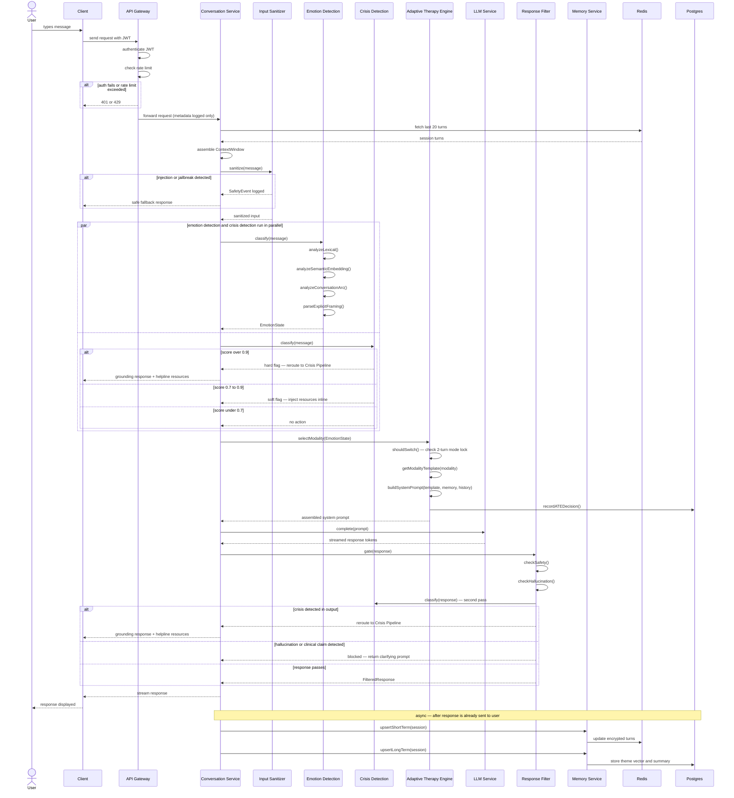

---

## UML Sequence Diagram

Shows the exact sequence of calls between objects during one conversation turn — who calls who, in what order, and what comes back.

```mermaid
sequenceDiagram
    actor User
    participant Client
    participant Gateway as API Gateway
    participant Conv as Conversation Service
    participant Sanitizer as Input Sanitizer
    participant Emotion as Emotion Detection
    participant Crisis as Crisis Detection
    participant ATE as Adaptive Therapy Engine
    participant LLM as LLM Service
    participant Filter as Response Filter
    participant Memory as Memory Service
    participant Redis as Redis
    participant Postgres as Postgres

    User->>Client: types message
    Client->>Gateway: send request with JWT

    Gateway->>Gateway: authenticate JWT
    Gateway->>Gateway: check rate limit
    alt auth fails or rate limit exceeded
        Gateway-->>Client: 401 or 429
    end

    Gateway->>Conv: forward request (metadata logged only)

    Conv->>Redis: fetch last 20 turns
    Redis-->>Conv: session turns
    Conv->>Conv: assemble ContextWindow

    Conv->>Sanitizer: sanitize(message)
    alt injection or jailbreak detected
        Sanitizer-->>Conv: SafetyEvent logged
        Conv-->>Client: safe fallback response
    end
    Sanitizer-->>Conv: sanitized input

    par emotion detection and crisis detection run in parallel
        Conv->>Emotion: classify(message)
        Emotion->>Emotion: analyzeLexical()
        Emotion->>Emotion: analyzeSemanticEmbedding()
        Emotion->>Emotion: analyzeConversationArc()
        Emotion->>Emotion: parseExplicitFraming()
        Emotion-->>Conv: EmotionState

    and
        Conv->>Crisis: classify(message)
        alt score over 0.9
            Crisis-->>Conv: hard flag — reroute to Crisis Pipeline
            Conv-->>Client: grounding response + helpline resources
        else score 0.7 to 0.9
            Crisis-->>Conv: soft flag — inject resources inline
        else score under 0.7
            Crisis-->>Conv: no action
        end
    end

    Conv->>ATE: selectModality(EmotionState)
    ATE->>ATE: shouldSwitch() — check 2-turn mode lock
    ATE->>ATE: getModalityTemplate(modality)
    ATE->>ATE: buildSystemPrompt(template, memory, history)
    ATE->>Postgres: recordATEDecision()
    ATE-->>Conv: assembled system prompt

    Conv->>LLM: complete(prompt)
    LLM-->>Conv: streamed response tokens

    Conv->>Filter: gate(response)
    Filter->>Filter: checkSafety()
    Filter->>Filter: checkHallucination()
    Filter->>Crisis: classify(response) — second pass
    alt crisis detected in output
        Filter-->>Conv: reroute to Crisis Pipeline
        Conv-->>Client: grounding response + helpline resources
    else hallucination or clinical claim detected
        Filter-->>Conv: blocked — return clarifying prompt
    else response passes
        Filter-->>Conv: FilteredResponse
    end

    Conv-->>Client: stream response
    Client-->>User: response displayed

    Note over Conv,Postgres: async — after response is already sent to user
    Conv->>Memory: upsertShortTerm(session)
    Memory->>Redis: update encrypted turns

    Conv->>Memory: upsertLongTerm(session)
    Memory->>Postgres: store theme vector and summary
```