## Class Diagram

```mermaid
classDiagram
    class User {
        +UUID userId
        +String emailHash
        +Boolean isPremium
        +Timestamp createdAt
        +Boolean isDeleted
        +createSession(incognito: bool) Session
        +deleteAccount() void
        +exportData() EncryptedPackage
        +forgetMe() void
    }

    class PrivacySettings {
        +UUID settingsId
        +UUID userId
        +Int retentionDays
        +Boolean incognitoMode
        +Boolean autoDeleteEnabled
        +setRetention(days: int) void
        +enableIncognito() void
    }

    class Session {
        +UUID sessionId
        +UUID userId
        +Timestamp startedAt
        +Timestamp endedAt
        +Int turnCount
        +Boolean isIncognito
        +Boolean isCompleted
        +addMessage(role: str, content: str) Message
        +close() void
        +tag(name: str) SessionTag
        +getContext() ContextWindow
    }

    class SessionTag {
        +UUID tagId
        +UUID sessionId
        +String tagName
        +rename(name: str) void
        +delete() void
    }

    class Message {
        +UUID messageId
        +UUID sessionId
        +Int turnNumber
        +String role
        +Timestamp createdAt
        +Int tokenCount
        +analyze() EmotionState
        +checkCrisis() CrisisFlag
        +checkSafety() SafetyEvent
    }

    class ContextWindow {
        +List turns
        +String longTermSummary
        +String systemPrompt
        +Int tokenBudget
        +Int maxTurns
        +assemble() String
        +compress() void
        +getRollingBlock() String
    }

    class EmotionState {
        +UUID emotionStateId
        +UUID messageId
        +String arousalLevel
        +String valence
        +String topicCategory
        +Float confidenceScore
        +toVector() Float[]
    }

    class EmotionDetectionService {
        +analyzeLexical(text: str) Float
        +analyzeSemanticEmbedding(text: str) Float[]
        +analyzeConversationArc(turns: List) Float
        +parseExplicitFraming(text: str) String
        +classify(message: Message) EmotionState
    }

    class TherapyModality {
        <<enumeration>>
        VALIDATION_CONTAINMENT
        EMPATHIC_JOURNALING
        CBT_THOUGHT_CHALLENGING
        MINDFULNESS_GROUNDING
        SFBT_SOLUTION_FOCUSED
        NARRATIVE_ACCEPTANCE
    }

    class ATEDecision {
        +UUID decisionId
        +UUID sessionId
        +UUID messageId
        +TherapyModality newModality
        +TherapyModality prevModality
        +Int signalCount
        +Timestamp createdAt
    }

    class AdaptiveTherapyEngine {
        +Int modeLockThreshold
        +TherapyModality currentModality
        +Int sustainedSignalCount
        +selectModality(state: EmotionState) TherapyModality
        +shouldSwitch(state: EmotionState) Boolean
        +buildSystemPrompt(modality: TherapyModality, memory: LongTermMemory) String
        +getModalityTemplate(modality: TherapyModality) PromptTemplate
        +recordDecision(session: Session) ATEDecision
    }

    class PromptTemplate {
        +String modalityId
        +String identityLayer
        +String therapyModeInstructions
        +String safetyConstraints
        +String responseGuidance
        +String prohibited
        +render(memory: LongTermMemory, history: ContextWindow) String
    }

    class LLMService {
        +String modelId
        +Int maxTokens
        +Boolean streamEnabled
        +complete(prompt: str) String
        +stream(prompt: str) Stream
        +fallback() LLMService
    }

    class ResponseFilter {
        +checkSafety(response: str) Boolean
        +checkHallucination(response: str) Boolean
        +rerouteCrisis(response: str) Boolean
        +gate(response: str) FilteredResponse
    }

    class ShortTermMemory {
        +UUID sessionId
        +String encryptedTurns
        +Int ttlSeconds
        +Timestamp lastAccessed
        +get(sessionId: UUID) List
        +set(sessionId: UUID, turns: List) void
        +expire(sessionId: UUID) void
    }

    class LongTermMemory {
        +UUID memoryId
        +UUID userId
        +Date sessionDate
        +Float[] themeVector
        +String summaryJson
        +Timestamp expiresAt
        +extractThemes(session: Session) void
        +getSummary(userId: UUID) String
        +prune(userId: UUID) void
    }

    class MemoryService {
        +upsertShortTerm(session: Session) void
        +upsertLongTerm(session: Session) void
        +getSessionContext(sessionId: UUID) ContextWindow
        +getUserThemes(userId: UUID) LongTermMemory
        +purgeUser(userId: UUID) void
    }

    class CrisisFlag {
        +UUID flagId
        +UUID sessionId
        +String flagLevel
        +Float classifierScore
        +Boolean resourcesShown
        +escalate() void
        +showResources() List
    }

    class CrisisDetectionService {
        +Float softFlagThreshold
        +Float hardFlagThreshold
        +classify(message: Message) Float
        +isSoftFlag(score: Float) Boolean
        +isHardFlag(score: Float) Boolean
        +reroute(session: Session) void
    }

    class CrisisResource {
        +UUID resourceId
        +String name
        +String phoneNumber
        +String region
        +forRegion(region: str) CrisisResource
    }

    class CrisisPipeline {
        +handle(flag: CrisisFlag) String
        +getGroundingResponse() String
        +warmCache() void
    }

    class SafetyEvent {
        +UUID eventId
        +UUID sessionId
        +String eventType
        +Timestamp createdAt
        +log() void
    }

    class InputSanitizer {
        +stripInstructions(text: str) String
        +detectInjection(text: str) Boolean
        +detectToxic(text: str) Boolean
        +detectJailbreak(text: str) Boolean
        +sanitize(text: str) SanitizedInput
    }

    class AuditLog {
        +UUID logId
        +UUID sessionId
        +String eventType
        +Int tokenCount
        +Int latencyMs
        +write(session: Session, meta: dict) void
    }

    class ConversationService {
        +handleTurn(sessionId: UUID, message: str) String
        +assembleContext(session: Session) ContextWindow
        +dispatchToEmotion(message: Message) EmotionState
        +dispatchToATE(state: EmotionState) String
        +dispatchToLLM(prompt: str) String
        +updateSession(session: Session) void
    }

    class APIGateway {
        +authenticate(token: str) Boolean
        +rateLimit(userId: UUID) Boolean
        +route(request: Request) Response
        +logMetadata(sessionId: UUID, meta: dict) void
    }

    User "1" --> "1" PrivacySettings : configures
    User "1" --> "0..*" Session : starts
    User "1" --> "0..*" LongTermMemory : has
    Session "1" --> "0..*" Message : contains
    Session "1" --> "0..*" SessionTag : tagged with
    Session "1" --> "1" ShortTermMemory : cached in
    Session "1" --> "0..*" CrisisFlag : triggers
    Session "1" --> "0..*" SafetyEvent : logs
    Session "1" --> "0..*" AuditLog : records
    Session "1" --> "0..*" ATEDecision : drives
    Message --> EmotionState : analyzed by
    Message --> CrisisFlag : may raise
    EmotionState --> TherapyModality : maps to
    ATEDecision --> TherapyModality : selects
    ConversationService --> Session : manages
    ConversationService --> ContextWindow : assembles
    ConversationService --> EmotionDetectionService : calls
    ConversationService --> AdaptiveTherapyEngine : calls
    ConversationService --> LLMService : calls
    ConversationService --> ResponseFilter : calls
    ConversationService --> MemoryService : calls
    AdaptiveTherapyEngine --> TherapyModality : selects
    AdaptiveTherapyEngine --> PromptTemplate : builds from
    AdaptiveTherapyEngine --> ATEDecision : records
    EmotionDetectionService --> EmotionState : produces
    MemoryService --> ShortTermMemory : manages
    MemoryService --> LongTermMemory : manages
    CrisisDetectionService --> CrisisFlag : creates
    CrisisDetectionService --> CrisisPipeline : routes to
    CrisisFlag --> CrisisResource : surfaces
    InputSanitizer --> SafetyEvent : logs
    ResponseFilter --> CrisisDetectionService : re-checks
    APIGateway --> ConversationService : forwards to
```



---
        EMPATHIC_JOURNALING
        CBT_THOUGHT_CHALLENGING
        MINDFULNESS_GROUNDING
        SFBT_SOLUTION_FOCUSED
        NARRATIVE_ACCEPTANCE
    }

    class ATEDecision {
        +UUID decisionId
        +UUID sessionId
        +UUID messageId
        +TherapyModality newModality
        +TherapyModality prevModality
        +Int signalCount
        +Timestamp createdAt
    }

    class AdaptiveTherapyEngine {
        +Int modeLockThreshold
        +TherapyModality currentModality
        +Int sustainedSignalCount
        +selectModality(state: EmotionState) TherapyModality
        +shouldSwitch(state: EmotionState) Boolean
        +buildSystemPrompt(modality: TherapyModality, memory: LongTermMemory) String
        +getModalityTemplate(modality: TherapyModality) PromptTemplate
        +recordDecision(session: Session) ATEDecision
    }

    class PromptTemplate {
        +String modalityId
        +String identityLayer
        +String therapyModeInstructions
        +String safetyConstraints
        +String responseGuidance
        +String prohibited
        +render(memory: LongTermMemory, history: ContextWindow) String
    }

    class LLMService {
        +String modelId
        +Int maxTokens
        +Boolean streamEnabled
        +complete(prompt: str) String
        +stream(prompt: str) Stream
        +fallback() LLMService
    }

    class ResponseFilter {
        +checkSafety(response: str) Boolean
        +checkHallucination(response: str) Boolean
        +rerouteCrisis(response: str) Boolean
        +gate(response: str) FilteredResponse
    }

    class ShortTermMemory {
        +UUID sessionId
        +String encryptedTurns
        +Int ttlSeconds
        +Timestamp lastAccessed
        +get(sessionId: UUID) List
        +set(sessionId: UUID, turns: List) void
        +expire(sessionId: UUID) void
    }

    class LongTermMemory {
        +UUID memoryId
        +UUID userId
        +Date sessionDate
        +Float[] themeVector
        +String summaryJson
        +Timestamp expiresAt
        +extractThemes(session: Session) void
        +getSummary(userId: UUID) String
        +prune(userId: UUID) void
    }

    class MemoryService {
        +upsertShortTerm(session: Session) void
        +upsertLongTerm(session: Session) void
        +getSessionContext(sessionId: UUID) ContextWindow
        +getUserThemes(userId: UUID) LongTermMemory
        +purgeUser(userId: UUID) void
    }

    class CrisisFlag {
        +UUID flagId
        +UUID sessionId
        +String flagLevel
        +Float classifierScore
        +Boolean resourcesShown
        +escalate() void
        +showResources() List
    }

    class CrisisDetectionService {
        +Float softFlagThreshold
        +Float hardFlagThreshold
        +classify(message: Message) Float
        +isSoftFlag(score: Float) Boolean
        +isHardFlag(score: Float) Boolean
        +reroute(session: Session) void
    }

    class CrisisResource {
        +UUID resourceId
        +String name
        +String phoneNumber
        +String region
        +forRegion(region: str) CrisisResource
    }

    class CrisisPipeline {
        +handle(flag: CrisisFlag) String
        +getGroundingResponse() String
        +warmCache() void
    }

    class SafetyEvent {
        +UUID eventId
        +UUID sessionId
        +String eventType
        +Timestamp createdAt
        +log() void
    }

    class InputSanitizer {
        +stripInstructions(text: str) String
        +detectInjection(text: str) Boolean
        +detectToxic(text: str) Boolean
        +detectJailbreak(text: str) Boolean
        +sanitize(text: str) SanitizedInput
    }

    class AuditLog {
        +UUID logId
        +UUID sessionId
        +String eventType
        +Int tokenCount
        +Int latencyMs
        +write(session: Session, meta: dict) void
    }

    class ConversationService {
        +handleTurn(sessionId: UUID, message: str) String
        +assembleContext(session: Session) ContextWindow
        +dispatchToEmotion(message: Message) EmotionState
        +dispatchToATE(state: EmotionState) String
        +dispatchToLLM(prompt: str) String
        +updateSession(session: Session) void
    }

    class APIGateway {
        +authenticate(token: str) Boolean
        +rateLimit(userId: UUID) Boolean
        +route(request: Request) Response
        +logMetadata(sessionId: UUID, meta: dict) void
    }

    User "1" --> "1" PrivacySettings : configures
    User "1" --> "0..*" Session : starts
    User "1" --> "0..*" LongTermMemory : has
    Session "1" --> "0..*" Message : contains
    Session "1" --> "0..*" SessionTag : tagged with
    Session "1" --> "1" ShortTermMemory : cached in
    Session "1" --> "0..*" CrisisFlag : triggers
    Session "1" --> "0..*" SafetyEvent : logs
    Session "1" --> "0..*" AuditLog : records
    Session "1" --> "0..*" ATEDecision : drives
    Message --> EmotionState : analyzed by
    Message --> CrisisFlag : may raise
    EmotionState --> TherapyModality : maps to
    ATEDecision --> TherapyModality : selects
    ConversationService --> Session : manages
    ConversationService --> ContextWindow : assembles
    ConversationService --> EmotionDetectionService : calls
    ConversationService --> AdaptiveTherapyEngine : calls
    ConversationService --> LLMService : calls
    ConversationService --> ResponseFilter : calls
    ConversationService --> MemoryService : calls
    AdaptiveTherapyEngine --> TherapyModality : selects
    AdaptiveTherapyEngine --> PromptTemplate : builds from
    AdaptiveTherapyEngine --> ATEDecision : records
    EmotionDetectionService --> EmotionState : produces
    MemoryService --> ShortTermMemory : manages
    MemoryService --> LongTermMemory : manages
    CrisisDetectionService --> CrisisFlag : creates
    CrisisDetectionService --> CrisisPipeline : routes to
    CrisisFlag --> CrisisResource : surfaces
    InputSanitizer --> SafetyEvent : logs
    ResponseFilter --> CrisisDetectionService : re-checks
    APIGateway --> ConversationService : forwards to
```

---
        EMPATHIC_JOURNALING
        CBT_THOUGHT_CHALLENGING
        MINDFULNESS_GROUNDING
        SFBT_SOLUTION_FOCUSED
        NARRATIVE_ACCEPTANCE
    }

    class ATEDecision {
        +UUID decisionId
        +UUID sessionId
        +UUID messageId
        +TherapyModality newModality
        +TherapyModality prevModality
        +Int signalCount
        +Timestamp createdAt
    }

    class AdaptiveTherapyEngine {
        +Int modeLockThreshold
        +TherapyModality currentModality
        +Int sustainedSignalCount
        +selectModality(state: EmotionState) TherapyModality
        +shouldSwitch(state: EmotionState) Boolean
        +buildSystemPrompt(modality: TherapyModality, memory: LongTermMemory) String
        +getModalityTemplate(modality: TherapyModality) PromptTemplate
        +recordDecision(session: Session) ATEDecision
    }

    class PromptTemplate {
        +String modalityId
        +String identityLayer
        +String therapyModeInstructions
        +String safetyConstraints
        +String responseGuidance
        +String prohibited
        +render(memory: LongTermMemory, history: ContextWindow) String
    }

    class LLMService {
        +String modelId
        +Int maxTokens
        +Boolean streamEnabled
        +complete(prompt: str) String
        +stream(prompt: str) Stream
        +fallback() LLMService
    }

    class ResponseFilter {
        +checkSafety(response: str) Boolean
        +checkHallucination(response: str) Boolean
        +rerouteCrisis(response: str) Boolean
        +gate(response: str) FilteredResponse
    }

    class ShortTermMemory {
        +UUID sessionId
        +String encryptedTurns
        +Int ttlSeconds
        +Timestamp lastAccessed
        +get(sessionId: UUID) List
        +set(sessionId: UUID, turns: List) void
        +expire(sessionId: UUID) void
    }

    class LongTermMemory {
        +UUID memoryId
        +UUID userId
        +Date sessionDate
        +Float[] themeVector
        +String summaryJson
        +Timestamp expiresAt
        +extractThemes(session: Session) void
        +getSummary(userId: UUID) String
        +prune(userId: UUID) void
    }

    class MemoryService {
        +upsertShortTerm(session: Session) void
        +upsertLongTerm(session: Session) void
        +getSessionContext(sessionId: UUID) ContextWindow
        +getUserThemes(userId: UUID) LongTermMemory
        +purgeUser(userId: UUID) void
    }

    class CrisisFlag {
        +UUID flagId
        +UUID sessionId
        +String flagLevel
        +Float classifierScore
        +Boolean resourcesShown
        +escalate() void
        +showResources() List
    }

    class CrisisDetectionService {
        +Float softFlagThreshold
        +Float hardFlagThreshold
        +classify(message: Message) Float
        +isSoftFlag(score: Float) Boolean
        +isHardFlag(score: Float) Boolean
        +reroute(session: Session) void
    }

    class CrisisResource {
        +UUID resourceId
        +String name
        +String phoneNumber
        +String region
        +forRegion(region: str) CrisisResource
    }

    class CrisisPipeline {
        +handle(flag: CrisisFlag) String
        +getGroundingResponse() String
        +warmCache() void
    }

    class SafetyEvent {
        +UUID eventId
        +UUID sessionId
        +String eventType
        +Timestamp createdAt
        +log() void
    }

    class InputSanitizer {
        +stripInstructions(text: str) String
        +detectInjection(text: str) Boolean
        +detectToxic(text: str) Boolean
        +detectJailbreak(text: str) Boolean
        +sanitize(text: str) SanitizedInput
    }

    class AuditLog {
        +UUID logId
        +UUID sessionId
        +String eventType
        +Int tokenCount
        +Int latencyMs
        +write(session: Session, meta: dict) void
    }

    class ConversationService {
        +handleTurn(sessionId: UUID, message: str) String
        +assembleContext(session: Session) ContextWindow
        +dispatchToEmotion(message: Message) EmotionState
        +dispatchToATE(state: EmotionState) String
        +dispatchToLLM(prompt: str) String
        +updateSession(session: Session) void
    }

    class APIGateway {
        +authenticate(token: str) Boolean
        +rateLimit(userId: UUID) Boolean
        +route(request: Request) Response
        +logMetadata(sessionId: UUID, meta: dict) void
    }

    User "1" --> "1" PrivacySettings : configures
    User "1" --> "0..*" Session : starts
    User "1" --> "0..*" LongTermMemory : has
    Session "1" --> "0..*" Message : contains
    Session "1" --> "0..*" SessionTag : tagged with
    Session "1" --> "1" ShortTermMemory : cached in
    Session "1" --> "0..*" CrisisFlag : triggers
    Session "1" --> "0..*" SafetyEvent : logs
    Session "1" --> "0..*" AuditLog : records
    Session "1" --> "0..*" ATEDecision : drives
    Message --> EmotionState : analyzed by
    Message --> CrisisFlag : may raise
    EmotionState --> TherapyModality : maps to
    ATEDecision --> TherapyModality : selects
    ConversationService --> Session : manages
    ConversationService --> ContextWindow : assembles
    ConversationService --> EmotionDetectionService : calls
    ConversationService --> AdaptiveTherapyEngine : calls
    ConversationService --> LLMService : calls
    ConversationService --> ResponseFilter : calls
    ConversationService --> MemoryService : calls
    AdaptiveTherapyEngine --> TherapyModality : selects
    AdaptiveTherapyEngine --> PromptTemplate : builds from
    AdaptiveTherapyEngine --> ATEDecision : records
    EmotionDetectionService --> EmotionState : produces
    MemoryService --> ShortTermMemory : manages
    MemoryService --> LongTermMemory : manages
    CrisisDetectionService --> CrisisFlag : creates
    CrisisDetectionService --> CrisisPipeline : routes to
    CrisisFlag --> CrisisResource : surfaces
    InputSanitizer --> SafetyEvent : logs
    ResponseFilter --> CrisisDetectionService : re-checks
    APIGateway --> ConversationService : forwards to
```

---
        +isSoftFlag(score: Float) Boolean
        +isHardFlag(score: Float) Boolean
        +reroute(session: Session) void
    }

    class CrisisResource {
        +UUID resourceId
        +String name
        +String phoneNumber
        +String region
        +forRegion(region: str) CrisisResource
    }

    class CrisisPipeline {
        +handle(flag: CrisisFlag) String
        +getGroundingResponse() String
        +warmCache() void
    }

    class SafetyEvent {
        +UUID eventId
        +UUID sessionId
        +String eventType
        +Timestamp createdAt
        +log() void
    }

    class InputSanitizer {
        +stripInstructions(text: str) String
        +detectInjection(text: str) Boolean
        +detectToxic(text: str) Boolean
        +detectJailbreak(text: str) Boolean
        +sanitize(text: str) SanitizedInput
    }

    class AuditLog {
        +UUID logId
        +UUID sessionId
        +String eventType
        +Int tokenCount
        +Int latencyMs
        +write(session: Session, meta: dict) void
    }

    class ConversationService {
        +handleTurn(sessionId: UUID, message: str) String
        +assembleContext(session: Session) ContextWindow
        +dispatchToEmotion(message: Message) EmotionState
        +dispatchToATE(state: EmotionState) String
        +dispatchToLLM(prompt: str) String
        +updateSession(session: Session) void
    }

    class APIGateway {
        +authenticate(token: str) Boolean
        +rateLimit(userId: UUID) Boolean
        +route(request: Request) Response
        +logMetadata(sessionId: UUID, meta: dict) void
    }

    User "1" --> "1" PrivacySettings : configures
    User "1" --> "0..*" Session : starts
    User "1" --> "0..*" LongTermMemory : has
    Session "1" --> "0..*" Message : contains
    Session "1" --> "0..*" SessionTag : tagged with
    Session "1" --> "1" ShortTermMemory : cached in
    Session "1" --> "0..*" CrisisFlag : triggers
    Session "1" --> "0..*" SafetyEvent : logs
    Session "1" --> "0..*" AuditLog : records
    Session "1" --> "0..*" ATEDecision : drives
    Message --> EmotionState : analyzed by
    Message --> CrisisFlag : may raise
    EmotionState --> TherapyModality : maps to
    ATEDecision --> TherapyModality : selects
    ConversationService --> Session : manages
    ConversationService --> ContextWindow : assembles
    ConversationService --> EmotionDetectionService : calls
    ConversationService --> AdaptiveTherapyEngine : calls
    ConversationService --> LLMService : calls
    ConversationService --> ResponseFilter : calls
    ConversationService --> MemoryService : calls
    AdaptiveTherapyEngine --> TherapyModality : selects
    AdaptiveTherapyEngine --> PromptTemplate : builds from
    AdaptiveTherapyEngine --> ATEDecision : records
    EmotionDetectionService --> EmotionState : produces
    MemoryService --> ShortTermMemory : manages
    MemoryService --> LongTermMemory : manages
    CrisisDetectionService --> CrisisFlag : creates
    CrisisDetectionService --> CrisisPipeline : routes to
    CrisisFlag --> CrisisResource : surfaces
    InputSanitizer --> SafetyEvent : logs
    ResponseFilter --> CrisisDetectionService : re-checks
    APIGateway --> ConversationService : forwards to
```

---
        +isSoftFlag(score: Float) Boolean
        +isHardFlag(score: Float) Boolean
        +reroute(session: Session) void
    }

    class CrisisResource {
        +UUID resourceId
        +String name
        +String phoneNumber
        +String region
        +forRegion(region: str) CrisisResource
    }

    class CrisisPipeline {
        +handle(flag: CrisisFlag) String
        +getGroundingResponse() String
        +warmCache() void
    }

    class SafetyEvent {
        +UUID eventId
        +UUID sessionId
        +String eventType
        +Timestamp createdAt
        +log() void
    }

    class InputSanitizer {
        +stripInstructions(text: str) String
        +detectInjection(text: str) Boolean
        +detectToxic(text: str) Boolean
        +detectJailbreak(text: str) Boolean
        +sanitize(text: str) SanitizedInput
    }

    class AuditLog {
        +UUID logId
        +UUID sessionId
        +String eventType
        +Int tokenCount
        +Int latencyMs
        +write(session: Session, meta: dict) void
    }

    class ConversationService {
        +handleTurn(sessionId: UUID, message: str) String
        +assembleContext(session: Session) ContextWindow
        +dispatchToEmotion(message: Message) EmotionState
        +dispatchToATE(state: EmotionState) String
        +dispatchToLLM(prompt: str) String
        +updateSession(session: Session) void
    }

    class APIGateway {
        +authenticate(token: str) Boolean
        +rateLimit(userId: UUID) Boolean
        +route(request: Request) Response
        +logMetadata(sessionId: UUID, meta: dict) void
    }

    User "1" --> "1" PrivacySettings : configures
    User "1" --> "0..*" Session : starts
    User "1" --> "0..*" LongTermMemory : has
    Session "1" --> "0..*" Message : contains
    Session "1" --> "0..*" SessionTag : tagged with
    Session "1" --> "1" ShortTermMemory : cached in
    Session "1" --> "0..*" CrisisFlag : triggers
    Session "1" --> "0..*" SafetyEvent : logs
    Session "1" --> "0..*" AuditLog : records
    Session "1" --> "0..*" ATEDecision : drives
    Message --> EmotionState : analyzed by
    Message --> CrisisFlag : may raise
    EmotionState --> TherapyModality : maps to
    ATEDecision --> TherapyModality : selects
    ConversationService --> Session : manages
    ConversationService --> ContextWindow : assembles
    ConversationService --> EmotionDetectionService : calls
    ConversationService --> AdaptiveTherapyEngine : calls
    ConversationService --> LLMService : calls
    ConversationService --> ResponseFilter : calls
    ConversationService --> MemoryService : calls
    AdaptiveTherapyEngine --> TherapyModality : selects
    AdaptiveTherapyEngine --> PromptTemplate : builds from
    AdaptiveTherapyEngine --> ATEDecision : records
    EmotionDetectionService --> EmotionState : produces
    MemoryService --> ShortTermMemory : manages
    MemoryService --> LongTermMemory : manages
    CrisisDetectionService --> CrisisFlag : creates
    CrisisDetectionService --> CrisisPipeline : routes to
    CrisisFlag --> CrisisResource : surfaces
    InputSanitizer --> SafetyEvent : logs
    ResponseFilter --> CrisisDetectionService : re-checks
    APIGateway --> ConversationService : forwards to
```

---
        +isSoftFlag(score: Float) Boolean
        +isHardFlag(score: Float) Boolean
        +reroute(session: Session) void
    }

    class CrisisResource {
        +UUID resourceId
        +String name
        +String phoneNumber
        +String region
        +forRegion(region: str) CrisisResource
    }

    class CrisisPipeline {
        +handle(flag: CrisisFlag) String
        +getGroundingResponse() String
        +warmCache() void
    }

    class SafetyEvent {
        +UUID eventId
        +UUID sessionId
        +String eventType
        +Timestamp createdAt
        +log() void
    }

    class InputSanitizer {
        +stripInstructions(text: str) String
        +detectInjection(text: str) Boolean
        +detectToxic(text: str) Boolean
        +detectJailbreak(text: str) Boolean
        +sanitize(text: str) SanitizedInput
    }

    class AuditLog {
        +UUID logId
        +UUID sessionId
        +String eventType
        +Int tokenCount
        +Int latencyMs
        +write(session: Session, meta: dict) void
    }

    class ConversationService {
        +handleTurn(sessionId: UUID, message: str) String
        +assembleContext(session: Session) ContextWindow
        +dispatchToEmotion(message: Message) EmotionState
        +dispatchToATE(state: EmotionState) String
        +dispatchToLLM(prompt: str) String
        +updateSession(session: Session) void
    }

    class APIGateway {
        +authenticate(token: str) Boolean
        +rateLimit(userId: UUID) Boolean
        +route(request: Request) Response
        +logMetadata(sessionId: UUID, meta: dict) void
    }

    User "1" --> "1" PrivacySettings : configures
    User "1" --> "0..*" Session : starts
    User "1" --> "0..*" LongTermMemory : has
    Session "1" --> "0..*" Message : contains
    Session "1" --> "0..*" SessionTag : tagged with
    Session "1" --> "1" ShortTermMemory : cached in
    Session "1" --> "0..*" CrisisFlag : triggers
    Session "1" --> "0..*" SafetyEvent : logs
    Session "1" --> "0..*" AuditLog : records
    Session "1" --> "0..*" ATEDecision : drives
    Message --> EmotionState : analyzed by
    Message --> CrisisFlag : may raise
    EmotionState --> TherapyModality : maps to
    ATEDecision --> TherapyModality : selects
    ConversationService --> Session : manages
    ConversationService --> ContextWindow : assembles
    ConversationService --> EmotionDetectionService : calls
    ConversationService --> AdaptiveTherapyEngine : calls
    ConversationService --> LLMService : calls
    ConversationService --> ResponseFilter : calls
    ConversationService --> MemoryService : calls
    AdaptiveTherapyEngine --> TherapyModality : selects
    AdaptiveTherapyEngine --> PromptTemplate : builds from
    AdaptiveTherapyEngine --> ATEDecision : records
    EmotionDetectionService --> EmotionState : produces
    MemoryService --> ShortTermMemory : manages
    MemoryService --> LongTermMemory : manages
    CrisisDetectionService --> CrisisFlag : creates
    CrisisDetectionService --> CrisisPipeline : routes to
    CrisisFlag --> CrisisResource : surfaces
    InputSanitizer --> SafetyEvent : logs
    ResponseFilter --> CrisisDetectionService : re-checks
    APIGateway --> ConversationService : forwards to
```

---

## Flow Diagram

```mermaid
flowchart TD
    START([User types message])

    subgraph CLIENT["Client"]
        ENC[Send request to gateway]
    end

    subgraph GATEWAY["AWS API Gateway"]
        AUTH{Auth valid and rate limit OK?}
        REJECT([Return 401 or 429])
        METALOG[Log session ID, timestamp, token count only]
    end

    subgraph CONV["Conversation Service"]
        DECRYPT[Receive and decrypt message]
        FETCH[Fetch last 20 turns from Redis]
        ASSEMBLE[Assemble ContextWindow]
    end

    subgraph SANITIZE["Input Sanitizer"]
        SANCHECK{Injection, toxic, or jailbreak?}
        SAFELOG[Log SafetyEvent by type only]
        SAFERESP([Return safe fallback response])
        CLEAN[Pass sanitized input forward]
    end

    subgraph EMOTION["Emotion Detection"]
        LEX[Signal 1 — Lexical affect markers]
        SEM[Signal 2 — Semantic embedding]
        ARC[Signal 3 — Conversation arc]
        EXPLICIT[Signal 4 — Explicit user framing]
        ESTATE[Produce EmotionState vector]
    end

    subgraph CRISIS_D["Crisis Detection — parallel, non-blocking"]
        CCLASSIFY[Binary classifier on every message]
        CSCORE{Classifier score?}
        SOFTFLAG[Inject crisis resources inline]
        HARDFLAG[Reroute to Crisis Pipeline]
        NOCRISIS[No action]
    end

    subgraph CRISIS_P["Crisis Pipeline — 4-nines SLA"]
        CGROUND[Grounding-first response]
        CRESOURCE[Show iCall and Vandrevala resources]
        CAUDIT[Log session ID and timestamp only]
    end

    subgraph ATE_BOX["Adaptive Therapy Engine"]
        ATERECV[Receive EmotionState and history]
        ATELOCK{Sustained 2 or more turns of new signal?}
        HOLDMODE[Hold current modality]
        SWITCHMODE[Switch modality, record ATEDecision]
        INJECT[Inject therapy mode into PromptTemplate]
        ATTACHMEM[Attach long-term memory summary]
        BUILDPROMPT[Assemble final system prompt]
    end

    subgraph LLM_BOX["LLM Service"]
        LLMSTREAM[Send to managed API, stream response]
    end

    subgraph RF_BOX["Response Filter"]
        RFSAFE[Safety post-processing]
        RFCRISIS{Crisis signals in output?}
        RFHALLUC{Hallucination or clinical claim?}
        RFBLOCK[Block, replace with clarifying prompt]
        RFPASS[Response passes quality gate]
    end

    subgraph MEM_BOX["Memory Service — async after response sent"]
        MEMSHORT[Update Redis session turns]
        MEMLONG[Extract theme vector, store in Postgres]
    end

    subgraph RESP["Response to Client"]
        STREAM[Stream first token, target under 800ms P95]
        DONE([User sees response])
    end

    START --> ENC
    ENC --> AUTH
    AUTH -- No --> REJECT
    AUTH -- Yes --> METALOG
    METALOG --> DECRYPT
    DECRYPT --> FETCH
    FETCH --> ASSEMBLE
    ASSEMBLE --> SANCHECK
    SANCHECK -- Yes --> SAFELOG
    SAFELOG --> SAFERESP
    SANCHECK -- No --> CLEAN

    CLEAN --> LEX
    LEX --> SEM
    SEM --> ARC
    ARC --> EXPLICIT
    EXPLICIT --> ESTATE

    CLEAN --> CCLASSIFY
    CCLASSIFY --> CSCORE
    CSCORE -- p over 0.9 --> HARDFLAG
    CSCORE -- p 0.7 to 0.9 --> SOFTFLAG
    CSCORE -- p under 0.7 --> NOCRISIS
    HARDFLAG --> CGROUND
    CGROUND --> CRESOURCE
    CRESOURCE --> CAUDIT

    ESTATE --> ATERECV
    ATERECV --> ATELOCK
    ATELOCK -- No --> HOLDMODE
    ATELOCK -- Yes --> SWITCHMODE
    HOLDMODE --> INJECT
    SWITCHMODE --> INJECT
    INJECT --> ATTACHMEM
    ATTACHMEM --> BUILDPROMPT

    BUILDPROMPT --> LLMSTREAM

    LLMSTREAM --> RFSAFE
    RFSAFE --> RFCRISIS
    RFCRISIS -- Yes --> HARDFLAG
    RFCRISIS -- No --> RFHALLUC
    RFHALLUC -- Yes --> RFBLOCK
    RFHALLUC -- No --> RFPASS

    RFPASS --> STREAM
    STREAM --> DONE

    RFPASS --> MEMSHORT
    RFPASS --> MEMLONG
```

